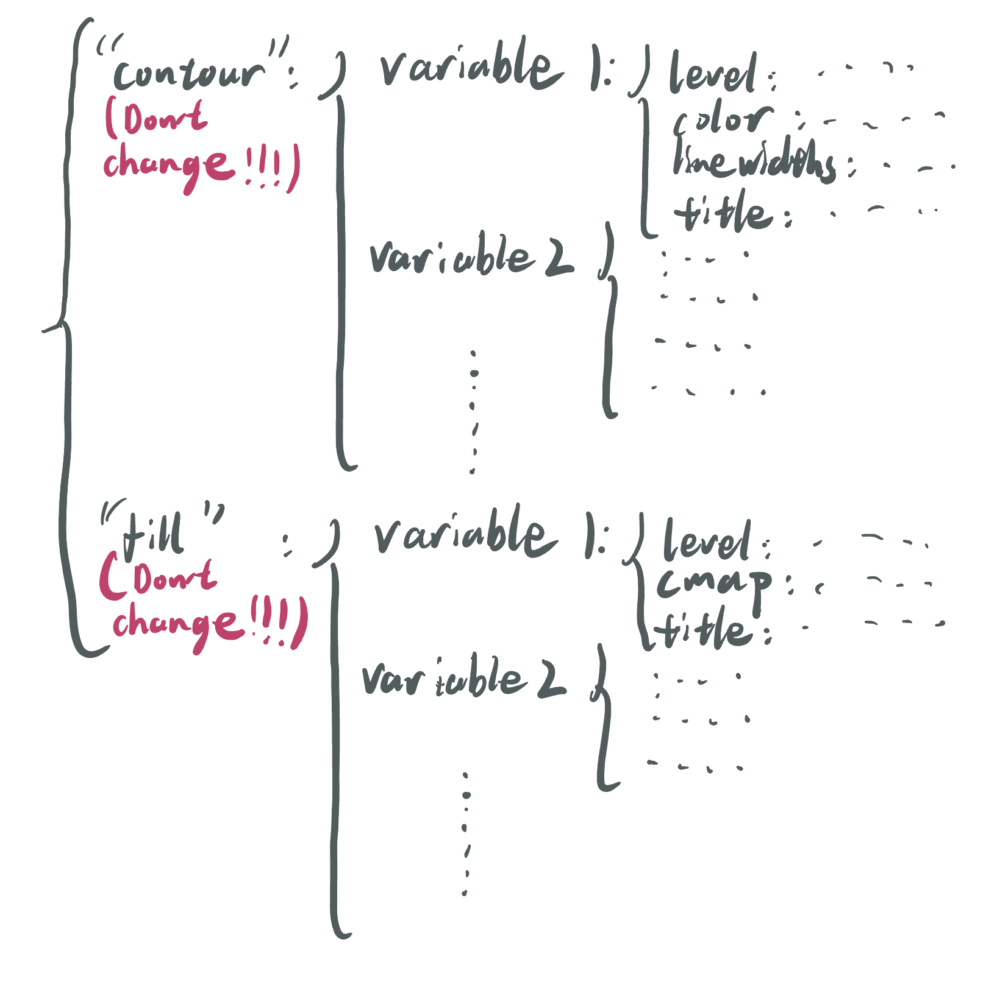

# <b><font size=18>Visual</font></b>

#### Todo List:
- [x] Make y-axis in log scale.
- [ ] Show the location of cross-section (Not fully done)
- [ ] Use mouse to draw area for plotting.
- [ ] Add better cmaps for variables (Namely, making small magnitude invisible).\
. \
. \
. 

---

#### Version 0.0.4 (Tracking)

- Output can now show the location of each cross-section
- (Specifically, the estimation file now return two objects, one is the list of coordinates for the scanner, another is the information of the plot used in estimation() and can be used in scanner by setting prec = (your input). If "prec=" is not specified, the cross-section track will not show up.) 
- Changed the default omega and pv colorbars

---

#### Version 0.0.3 (Trial release)

- I am making the package to be more formal
- First release with .py files

---

#### Version 0.2 (I know there is no actual versioning, will be added formally with first .py file release:

- Making the plot y axis in logarithm scale. 
- Adding a requirement of keeping pyproj version updated. 

---

#### Version 0.1

- First release.

---

There are several files in this repo:\
-/data: The place storing the data.\
-/data/12z.grib: The file used in the notebook in .grib format (Retrieved from [ERA5 dataset](https://cds.climate.copernicus.eu/cdsapp#!/dataset/reanalysis-era5-pressure-levels?tab=form)).\
-README.md :The readme file (Or what you are looking at now).\
-environment.yml: The environment file used in this project (The same as the AOS573 environment.)
-Scanner.ipynb: A notebook includes all the procedures and functions with mare detailed explaination on the code.\
-plotfile.png & Function illustration.png: images embedded in markdown file.\
-trial.gif: A gif as a result of running the whole notebook (as an alternate solution for Jupyterhub doesn't have ffmpeg).\
-effect.mp4: A video generated by local jupyterlab with exactly the same function in the notebook in this repository (Again, since the ffmpeg is unavainable to use here, this video is for people to see what the function should return if ffmpeg is working.

This notebook is dedicated for making scanning of an area by cross sections from ERA5 dataset as shown by the figure:\


Such goal is achieved by the following:

First, present a base plot to choose following points by running estimation(): \
Initial start point (pos1 in the function), \
initial end point(pos2 in the function), \
and final end point(pos3 in the function).

Then, run scanner() to generate a video, whihc plays the cross sections from the starting line to the final line.

A selection function(selection()) is also defined for extracting desired dataset.

One important component of the notebook is a dictionary called <b>plotfile</b> that includes parameter for plotting inside of the estimation() and the scanner() function.
Here is the plotfile used in the notebook:
```python
    plotfile={'contour':{
                 'thta':{'level': np.arange(250, 450, 3),
                         'color':'red',
                         'linewidths':1,
                         'title':"Potential temperature (K)"},
                    'z':{'level': np.arange(0, 10000, 60),
                         'color':'black',
                         'linewidths':1, 
                         'title': "Geopotential height (m)"},
                    't':{'level': np.arange(0, 400, 3),
                         'color':'black',
                         'linewidths':1, 
                         'title': "Temperature (K)"}},
             'fill':{
                   'vo':{'level': np.arange(5e-5,40e-5,5e-5),
                         'cmap':plt.cm.YlOrRd,
                         'title': "Relative vorticity(1/s)"},
                    'w':{'level': np.arange(-3.5, 3.6, 0.5),
                         'cmap':plt.cm.PRGn,
                         'title': "Omega(Pa/s)"}}}

```
And the structure looks like such:
    
    
<b>Now, if you haven't see the notebook yet, please see it and enjoy!</b>
